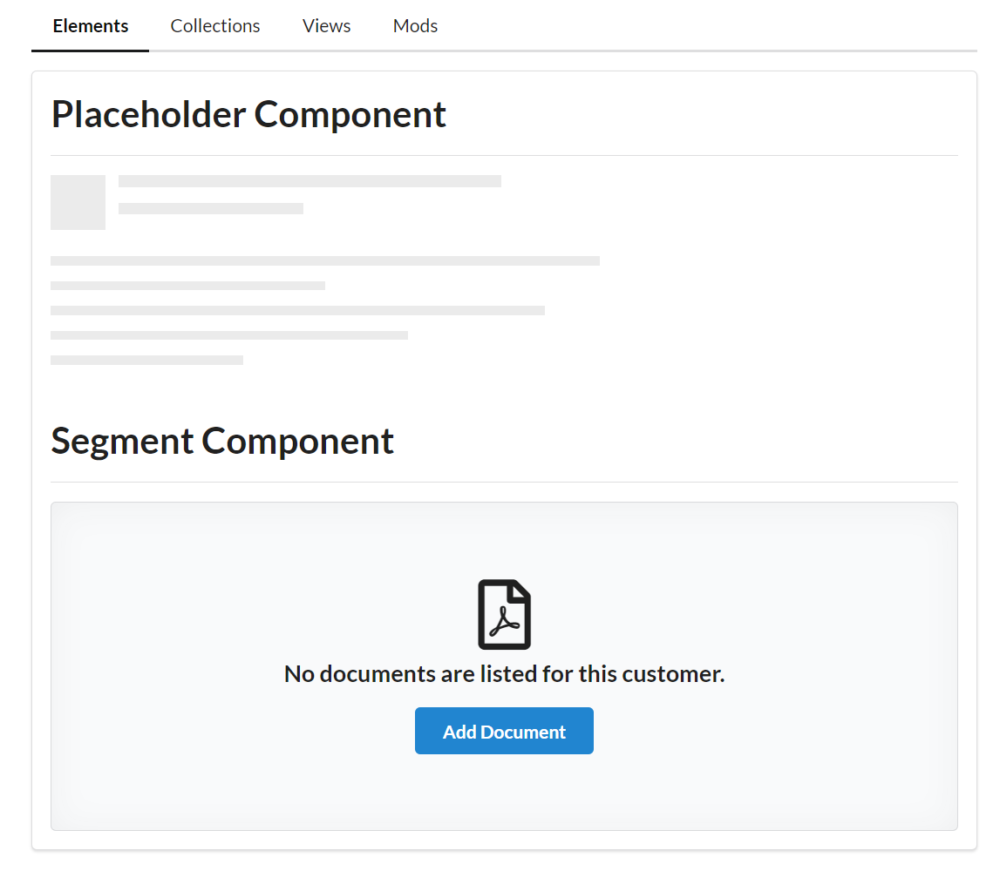

<h1 align="center">Components</h1>

   Project created for practice and improving knowledge of Angular and TypeScript.

  <h3>
    <a href="https://comps-beryl.vercel.app">
      Demo
    </a>
  </h3>

## Table of Contents

- [Overview](#overview)
- [Built With](#built-with)
- [Contact](#contact)

## Overview

With this project I've learned/improved:

- Module System
- Routing
- Lazy Loading with Modules

## Built With

- This project was generated with [Angular CLI](https://github.com/angular/angular-cli) version 16.1.1.
- Deploy with [Vercel CLI](https://vercel.com) version 30.2.3.
- [Semantic-Ui](https://semantic-ui.com/)

## Contact

- Website [cv-webpage](https://ievgeniiaabdulina.github.io/rsschool-cv/)
- Portfolio [Personal-Portfolio-Webpage](https://ievgeniiaabdulina.github.io/Personal-Portfolio-Webpage/)
- GitHub [@IevgeniiaAbdulina](https://github.com/IevgeniiaAbdulina)

 
Date: 7/2023
